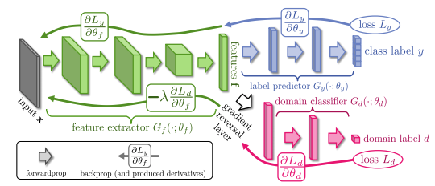
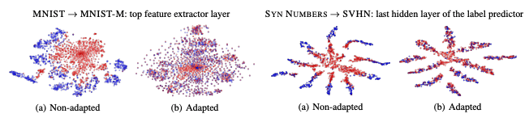

# Unsupervised Domain Adaptation by Backpropagation
[](https://arxiv.org/abs/1409.7495)

Pytorch implementation for the **Gradient Reversal Layer** in paper ["Unsupervised Domain Adaptation by Backpropagation"](https://arxiv.org/abs/1409.7495).

```
@misc{ganin2015unsupervised,
      title={Unsupervised Domain Adaptation by Backpropagation}, 
      author={Yaroslav Ganin and Victor Lempitsky},
      year={2015},
      eprint={1409.7495},
      archivePrefix={arXiv},
      primaryClass={stat.ML}
}
```

# Gradient Reversal Layer


|  | 
|:--:| 
| *Gradient Reversal Layer* |

During the forward
propagation, Gradient Reversal Layer(GRL) acts as an identity transform. During
the backpropagation though, GRL takes the gradient from
the subsequent level, multiplies it by $−\alpha$ and passes it to
the preceding layers.


### forward pass: $R_\alpha (x) = x$


### backward pass: $\displaystyle \frac{dR_\alpha}{dx} = -\alpha x$

### where:
- $R$ is the Gradient Rervesal function
- $x$ is the input tensor
- $\alpha$ is the scaling factor for the reversed gradients.


|  | 
|:--:| 
| *Features on MNIST and SVHN* |


# Usage

As module
```python
from torch import nn
from gradient_reversal import GradientReversal

# define a network with Gradient Reversal Layer
net = nn.Sequential(
      nn.Linear(10, 10),
      nn.GradientReversal(alpha=1.)
)
```

As function
```python
import torch
from gradient_reversal import revgrad

alpha = torch.tensor([1.])

x = torch.tensor([4.], requires_grad=True)
x_rev = torch.tensor([4.], requires_grad=True)

y = x*5
y = y+6

y_rev = x_rev*5
y_rev = revgrad(y_rev, alpha)
y_rev = y_rev+6

y.backward()
y_rev.backward()

print(f'x gradient: {x.grad}')
print(f'reversed x gradient: {x_rev.grad}')

assert x.grad==-x_rev.grad
```